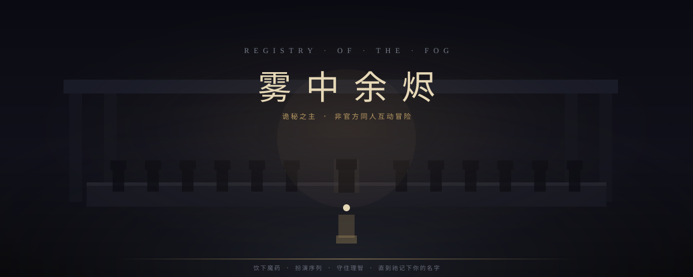
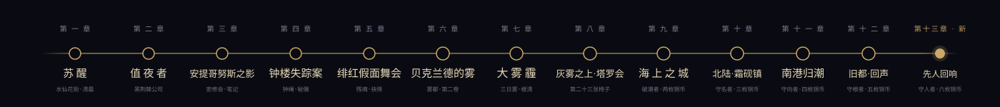

<p align="center">
  
</p>

<h3 align="center">以爱潜水的乌贼《诡秘之主》为蓝本的 · 非官方、非商业粉丝同人 · 在线文字冒险</h3>

<p align="center">
  在蒸汽与煤气灯的廷根死而复生，饮下魔药、扮演序列、守住理智——直到灰雾之上的注视降临。
</p>

<p align="center">
  
  
  
  
  
</p>

---

> 本项目为粉丝同人作品，与原作者及出版方无任何隶属关系。原作版权归作者所有。对白、叙事、场景美术均为重新创作；不收录小说全文、官方/动画/同人画作、未授权音乐。

## 一键运行

无需数据库、无需环境变量，克隆后两条命令即可游玩：

```bash
npm install
npm run dev
```

浏览器打开 **http://localhost:3000** 即可。构建与运行**不依赖 PostgreSQL**——数据库仅在配置了 `DATABASE_URL` 时启用，用于可选的云端存档备份，未配置时游戏照常运行。

> 仓库已附带 `node_modules` 的依赖清单（`package.json`），`npm install` 一次即可。开发服务器默认端口 3000。

## 六章剧情脉络

<p align="center">
  
</p>

从廷根的苏醒到雾都的远赴——前五章完整闭环于「绯红假面舞会」，第六章开启第二卷「贝克兰德的雾」。

## 玩法

- **六大章节**：苏醒 → 值夜者 → 安提哥努斯之影 → 钟楼失踪案 → 绯红假面舞会 → 贝克兰德的雾
- **二十二途径（六选一）**：占卜家 · 不眠者 · 收尸人 · 窥秘人 · 猎人 · 读运者，从序列 9 攀升至序列 8
- **扮演法 · 魔药消化**：做出符合途径「扮演法则」的选择可加速消化，消化满 100% 可申请晋升
- **三属性 D20 判定**：体魄 / 灵感 / 意志 + 途径修正 + 幸运，失败会推进到不同的（通常更危险的）分支
- **途径专属扮演分支**：每个关键判定都有读运者/收尸人/占卜家等途径的「扮演」解法——读门、通灵、窥未来
- **回合制战斗**：攻击 / 途径能力 / 物品 / 冥想，含护盾、屏障、反伤架势、易伤、凋零、暴击、闪避等机制
- **理智与失控**：直视超凡损耗理智，归零即失控结局；可经教堂祈祷、宁神药剂、护符缓解
- **12 种结局**：从「灰雾之邀」到「篡夺者」「殉锚」「廷根之狼」「廷根的守夜人」……
- **7 条支线**：值夜同僚、水仙花街窃影、铁十字街连环失踪、雾纹信使、灰河守墓人、钟楼秘偶、雾中拾遗

## 存档

- **本地优先**：以浏览器 IndexedDB 为权威来源，离线亦可游玩
- **多存档位**：1 个自动位 + 3 个手动位，可随时新建 / 读取 / 删除
- **可选云端备份**：配置 `DATABASE_URL` 后存档异步备份到云端；未配置时游戏照常运行
- **秘典**：结局回廊（已达成的结局揭示，未达成的封缄之雾遮蔽）+ 二十二途径图鉴 + 廷根卷宗（实时归档你在游戏里的积累）

## 技术栈

Next.js 16（Turbopack）· React 19 · TypeScript · Tailwind CSS v4 · Drizzle ORM · PostgreSQL（可选）· lucide-react

## 目录结构

```
src/
  app/
    page.tsx                落地页
    game/page.tsx           主游戏循环
    api/game/               可选云端存档 API
  components/game/          HUD / CombatPanel / PathwaySelect / EndingScreen
                           SaveSlotsPanel / CodexModal / DiceOverlay / Emblem
  lib/game/
    types.ts engine.ts      核心引擎与类型
    data.ts                 途径 / 物品 / 敌人
    story.ts                章节标题与结局注册
    story1.ts ~ story5.ts   第一~六章（286 节点）
    art.ts                  原创 SVG 场景背景
    persistence/            本地优先存档（IndexedDB）
  db/                       Drizzle schema（可选 Postgres）
```

## 开发

```bash
npm install      # 安装依赖
npm run dev      # 开发服务器
npm run build    # 生产构建（无需 DATABASE_URL 即可构建）
npm run typecheck
npm run lint
```

## 非目标与版权

- 非商业、无广告、无内购、无众筹
- 不收录小说全文、官方/动画/同人画作、未授权音乐
- 对白、叙事、场景美术均为重新创作；仅使用极少量的标志性短语

<p align="center">
  <sub>雾气之上，第二十三张椅子一直空着——祂为每一段走完的旅程留了位置。</sub>
</p>
